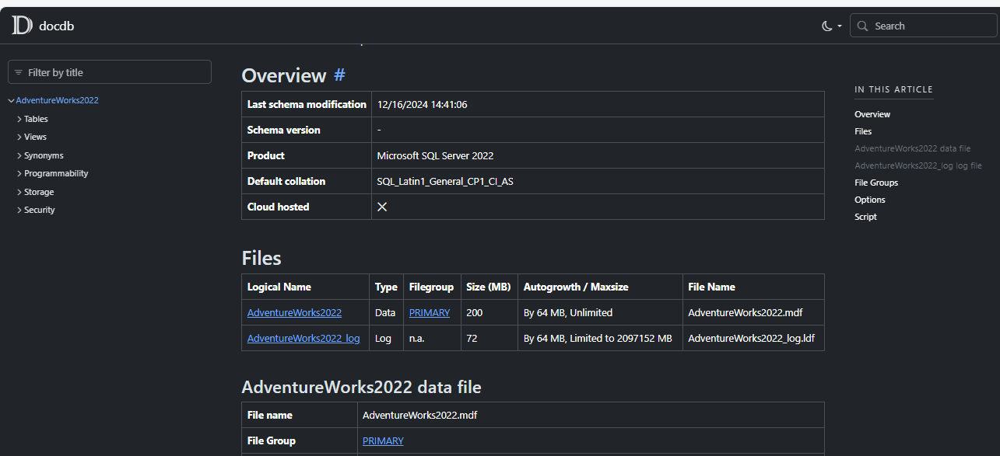
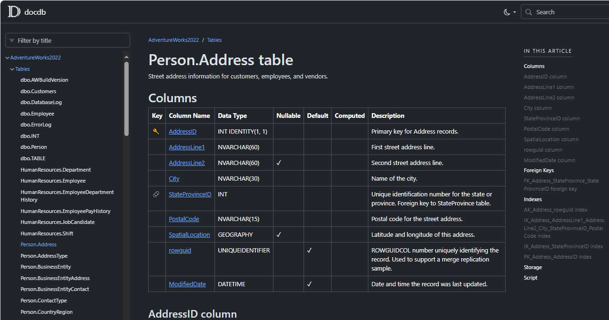
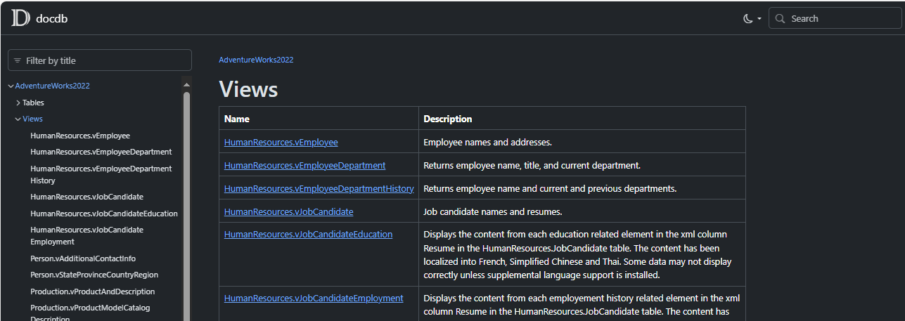
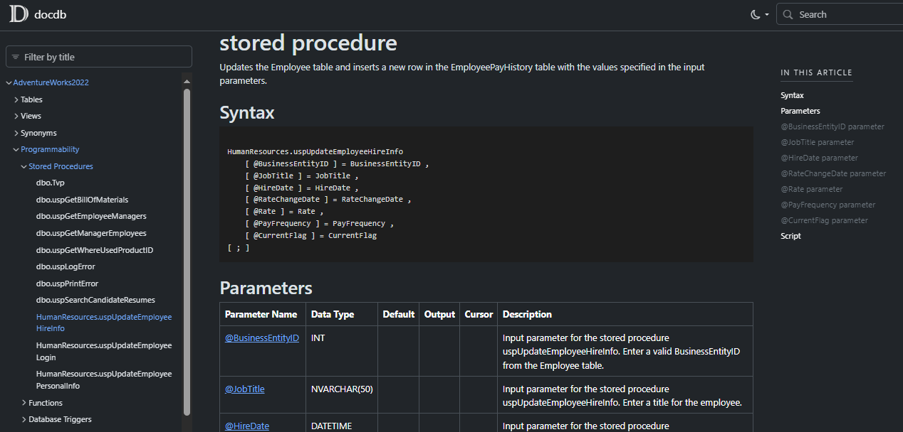

# DocDB

Generate metadata from SQL Server databases for use with [DocFX](https://github.com/dotnet/docfx) to generate reference documentation.

[](https://www.nuget.org/packages/docdb)
[](https://github.com/cklutz/docdb/actions?query=workflow%3AWindows)
[](https://github.com/cklutz/docdb/blob/master/LICENSE)

You can use this tool to generate meta data files (<code>.yml</code> files) for a given SQL Server database.
Then use <code>docfx</code> to generate reference documentation like you would do for other languages (e.g. C#).

__Warning__: Albeit usable, this tool is not complete. Still lacking are unit tests and code coverage and integration style tests. YMMV.

## Features

DocDB can document the following SQL Server objects:

* Tables (including indexes, checks, keys, triggers)
* Stored Procedures
* Functions (scalar, table valued, aggregates)
* Types (data types, table types, CLR types)
* Assemblies (incl. decompilied C# code)
* DDL Triggers
* XML Schema collections
* Parition information (functions, schemes)
* Sequences
* Rules
* Defaults
* Roles (database and application roles)
* Users
* Synonyms
* Schemas
* Database itself (files, filegroups, settings, etc.)

All documents and objects are cross references (for example, foreign keys to target table).
For every applicable object, the relevant SQL CREATE script is included.

Additionally, a table of contents is generated that structures the objects as they are in
the Object Explorer of SSMS.

## Getting Started

1. Install docfx as a global tool:

```bash
dotnet tool install -g docfx
```

2. Install DocDB as a global tool:

```bash
dotnet tool install -g docdb.console
```

**TODO**: Document rest of procedure (or see [AdventureWorks2022 sample](samples/AdventureWorks2022/README.md)).


## Examples

The following pictures are based on the [AdventureWorks Sample Database](https://github.com/microsoft/sql-server-samples/tree/master/samples/databases/adventure-works/oltp-install-script). To generate those yourself see [AdventureWorks2022 sample](samples/AdventureWorks2022/README.md).


*Database Overview*


*Table Details*


*Views Overview*


*Stored Procedure Details*
